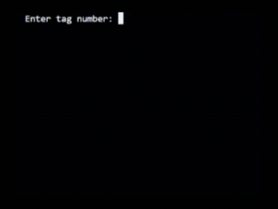
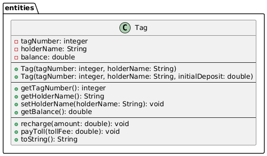

# Prepaid Toll Tag (Tag de Pedágio Pré-paga)

Este é um projeto prático desenvolvido em Java com o objetivo de consolidar os fundamentos da **Programação Orientada a Objetos (POO)**.

O sistema simula o funcionamento de uma tag de pedágio pré-paga (como Sem Parar, Veloe ou Via Verde), gerenciando recargas, passagens por cancelas de pedágio com cobrança de taxa de conveniência e exibição dos dados formatados do cliente.

---

## Demonstração de Uso

Veja abaixo o sistema rodando e interagindo com o usuário diretamente no terminal:



---

## Diagrama da Classe Tag

A estrutura abaixo representa a modelagem da classe `Tag` desenvolvida no pacote `entities`, demonstrando graficamente a divisão estruturada entre os atributos privados, construtores e métodos públicos.



---

## Conceitos de POO Aplicados

Durante o desenvolvimento deste projeto, foram aplicados os seguintes pilares e boas práticas:

* **Encapsulamento:** Atributos privados (`private`) com controle rígido de acesso. O saldo (`balance`) e o número da tag (`tagNumber`) possuem apenas métodos de leitura (*getters*), garantindo que alterações ocorram estritamente através de operações de negócio seguras.
* **Sobrecarga de Construtores:** Permite a inicialização de objetos de duas formas distintas:
    1. Passando apenas o número da tag e o nome do proprietário (o saldo inicial é zerado).
    2. Passando o número, o nome do proprietário e um depósito/recarga inicial.
* **Métodos de Negócio Coesos:** Toda a lógica de manipulação de estados está encapsulada na própria entidade. Por exemplo, o método `payToll` deduz o valor da tarifa somado a uma taxa administrativa fixa de conveniência de **$ 1.50**.
* **Organização em Pacotes:** Separação clara de responsabilidades entre as classes do domínio (`entities`) e a classe de ponto de entrada/interação (`application`).

---

## Estrutura do Projeto

O projeto está organizado conforme a árvore de diretórios abaixo:

```text
PREPAID-TOLL-TAG/
├── img/ 
│   ├── tag_class_diagram.png  # Diagrama de classe UML
│   └── demo.gif               # Gravação do funcionamento no terminal
├── src/
│   ├── application/
│   │   └── Program.java       # Interface e interação via console (Scanner)
│   └── entities/
│       └── Tag.java           # Entidade com regras de negócio e encapsulamento
├── LICENSE
└── README.md                  # Documentação do projeto